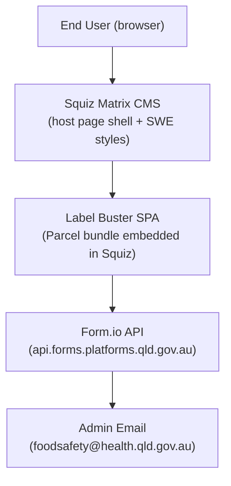
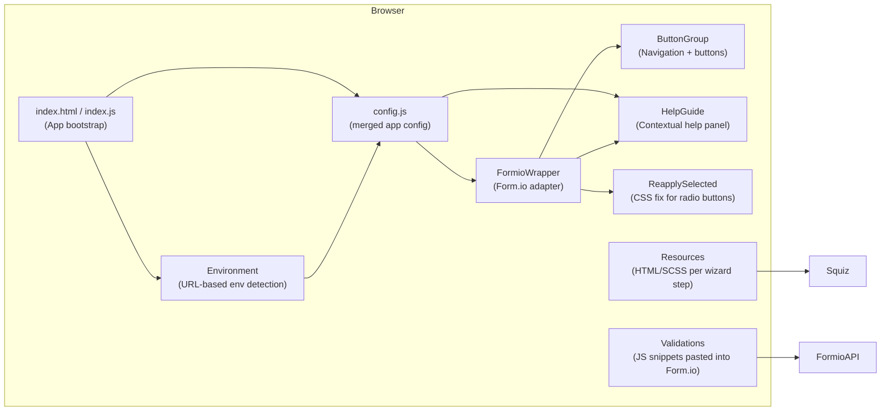
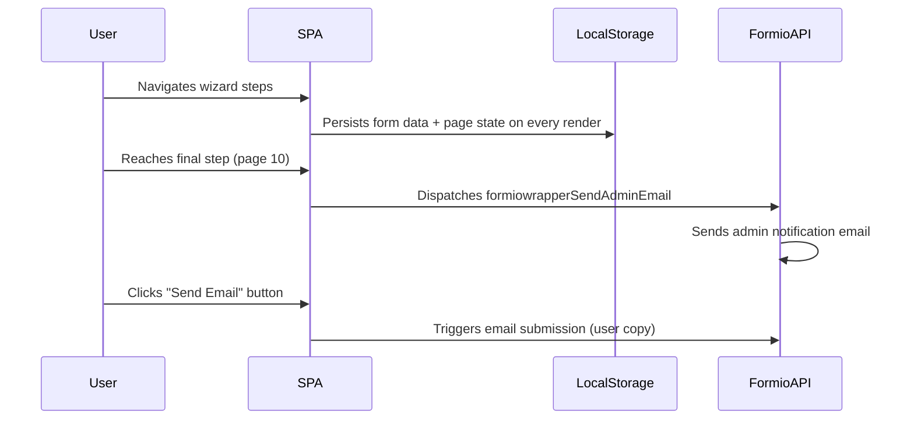
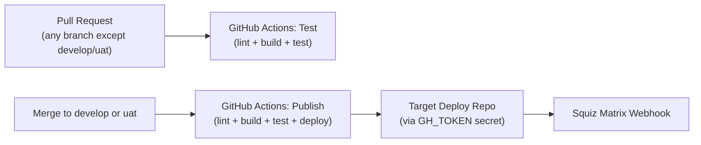

## Overview

Label Buster is a single-page application (SPA) embedded inside a Squiz Matrix CMS page. It uses Form.io as a wizard-form backend and CMS, SWE (Queensland Government Web Template) for design system components, and Parcel for bundling. The build output is a minified bundle pasted manually into Form.io and deployed to Squiz via CI/CD pipeline.

## System Context



- Squiz provides the outer HTML shell, navigation chrome, and SWE CSS
- The SPA mounts on `#formio` and `#help-guide` DOM elements injected by Squiz
- Form.io hosts the wizard form definition (JSON schema) and handles submission storage and email dispatch
- No data is persisted server-side by the SPA itself; form state lives in `localStorage`

## Technology Stack

| Layer | Technology | Why |
|---|---|---|
| Form rendering | Form.io (Wizard mode) | CMS-driven form schema; non-developers can modify form fields without code changes |
| UI components | lit-html 1.x | Lightweight template rendering without a full framework; IE 11 compatibility required |
| Styling | SASS + SWE | Queensland Government design system; Squiz matrix integration |
| Bundler | Parcel 1.x | Zero-config bundling with Babel transpilation for IE 11 support |
| Testing | Karma + Open-WC | Pre-configured browser-based testing compatible with lit-html web components |
| Linting | ESLint (Airbnb) + Prettier | Consistent code style enforced via Husky pre-commit hook |
| CI/CD | GitHub Actions | Test + lint on PRs; publish to target deploy repo on `develop`/`uat` branches |

## Application Layers



## Environment Model

`Environment` class detects runtime environment from `window.location.href`:

| URL pattern | Environment | Form.io tenant |
|---|---|---|
| `localhost` or `dev` | development | `dev-tzkqydhwrjrviss` |
| `uat` | uat | `uat-tzkqydhwrjrviss` |
| (default) | production | `tzkqydhwrjrviss` |

Environment overrides `config.form.location` and `config.form.baseLocation` at runtime. `window.formEnv` is set to the environment flag (`dev`/`uat`/`prod`) and included in form submissions.

## Data Flow: Form Submission



## CI/CD Pipeline



- `Test` workflow: Node 12, `npm install`, `npm run lint`, `npm run build`, `npm run test`
- `Publish` workflow: same steps plus `./deploy.sh` (force-pushes `dist/` to target repo) and webhook trigger to Squiz
- Form.io integration is manual: build output from `dist/` is copy-pasted into the Form.io project

## Developer Onboarding

Prerequisites: Node.js 12.x, npm

```
npm install
npm run start        # local dev server via Parcel (http://localhost:1234)
npm run build        # production bundle → dist/
npm run test         # Karma browser tests
npm run lint         # ESLint + Prettier check
```

Pre-commit hook (Husky) runs lint + build + test + format before every commit.

## Key Constraints

- **IE 11 support required**: Babel transpilation, no ES2019+ features, Parcel 1.x (not 2.x)
- **No server-side state**: all form progress in `localStorage`; clearing storage resets the form
- **Form.io as CMS**: form field changes are made in Form.io UI and do not require code changes; validation JS must be re-pasted after modification
- **Squiz embedding**: SPA must not conflict with Squiz's global CSS/JS; `#qg-section-nav` and `h1` within `#qg-primary-content` are manipulated at runtime
