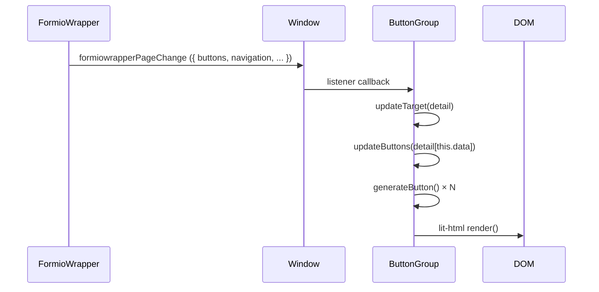
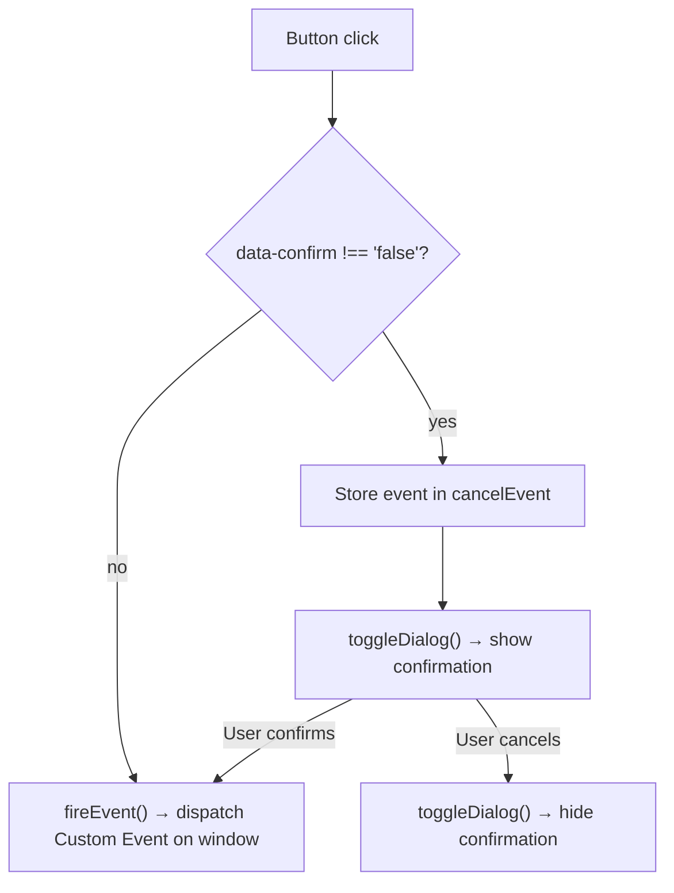

## Overview

`ButtonGroup` (`src/components/button-group.js`) is a lit-html-based component that renders navigation controls (Back/Next/Cancel buttons and the step progress menu) by consuming the `formiowrapperPageChange` event. It is instantiated twice in `index.js`: once for action buttons and once for the section navigation list.

## Responsibilities

- Render navigation buttons (Back, Next, Cancel) using lit-html into a target DOM element
- Render the wizard step progress menu as an `<ol>` of `<li><button>` elements
- Display and manage a cancel confirmation dialog
- Dispatch Form.io navigation events (`formiowrapperGoToNext`, `formiowrapperGoToPrevious`, `formiowrapperCancel`, `formiowrapperGoToPage`) on button clicks
- Handle the Squiz section nav parent `<li>` element as a clickable step-zero entry when `skipFirstNavStep` is configured

## Instantiation Pattern

Two instances created in `index.js`:

| Instance variable | Target element | `data` key |
|---|---|---|
| `bg` | `.button-container` | `'buttons'` (default) |
| `sectionNavigation` | `ol.lb.guide-sub-nav` inside `#qg-section-nav` | `'navigation'` |

The `data` parameter selects which property from the `formiowrapperPageChange` event detail to render (`buttons` or `navigation`).

## Render Flow

## Button Descriptor Schema

`FormioWrapper.buildButtonData()` returns an array of three descriptors consumed by the `buttons` instance:

| Field | Type | Description |
|---|---|---|
| `title` | string | Button label text |
| `event` | string | Custom event name fired on click |
| `cssClass` | string | Full CSS class string from config |
| `disabled` | boolean | Renders as `disabled` attribute and `'disabled'` CSS class |
| `displayed` | boolean | If false, renders empty template |
| `confirm` | boolean | If truthy, shows cancel confirmation dialog instead of firing event directly |
| `detail` | Object | Payload passed as `event.detail` |
| `type` | string | `'button'` (default) or `'li'` for nav items |
| `active` | boolean | Adds `'active'` CSS class |

## Navigation Descriptor Schema

`FormioWrapper.buildProgressMenuData()` returns an array for step navigation:

| Field | Type | Description |
|---|---|---|
| `title` | string | Wizard page title |
| `event` | string | Always `'formiowrapperGoToPage'` |
| `detail.page` | number | Target page index |
| `detail.currentPage` | number | Current wizard page |
| `cssClass` | string | `config.navigation.baseClass` + active/visited modifiers |
| `disabled` | boolean | True if a prerequisite page has not been completed |
| `active` | boolean | True if this is the currently displayed page |
| `type` | string | Always `'li'` |

## Click Handling

- `data-confirm` attribute is set to the button's `confirm` value as a string; checked as `!== 'false'`
- `data-event` and `data-detail` attributes carry the event name and JSON-serialised detail payload
- `window.dispatchEvent` fires the resolved event, picked up by `FormioWrapper`

## Cancel Confirmation Dialog

Rendered inline within the button container via lit-html. Configuration values consumed from `config.confirmation`:

| Config key | Usage |
|---|---|
| `title` | `<h2>` heading text |
| `description` | Body text |
| `closeXButton` | HTML string for close button icon (rendered via `unsafeHTML`) |
| `continueButtonText` | "Stay" button label |
| `continueButtonCssClass` | CSS class for stay button |
| `leaveButtonText` | "Leave" button label |
| `leaveButtonCssClass` | CSS class for leave button |

Dialog visibility is controlled by `this.showDialog` boolean; re-rendered via `render()` on toggle.

## Squiz Section Nav Integration

When `config.navigation.skipFirstNavStep` is true, the first step is omitted from the `<ol>` list. Instead, `updateParentIfFirstStepSkipped()` locates the Squiz-rendered `li > a.active` element in the parent DOM and adds click handling to it, making it function as step-zero navigation. The element is mutated once (tracked via `data-updated` attribute) and given `'opened'` class when on any page other than 0.

## Design Decisions

- **lit-html instead of a full framework**: Minimal runtime footprint required for IE 11 compatibility; lit-html's `html` tagged template literals provide efficient DOM diffing without a virtual DOM.
- **Event attribute pattern** (`data-event`, `data-detail` on DOM elements): Allows a single `processClick` handler on the component rather than per-button closures, and makes button state inspectable in DevTools.
- **`unsafeHTML` for close button**: The close icon is an HTML string from config (e.g. `<i class="fa fa-times"></i>`); `unsafeHTML` is intentional and acceptable since the value comes from controlled application configuration, not user input.
