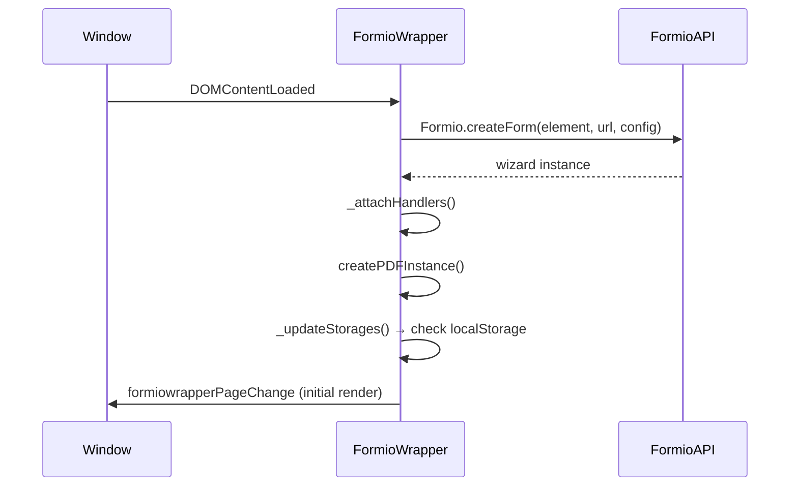
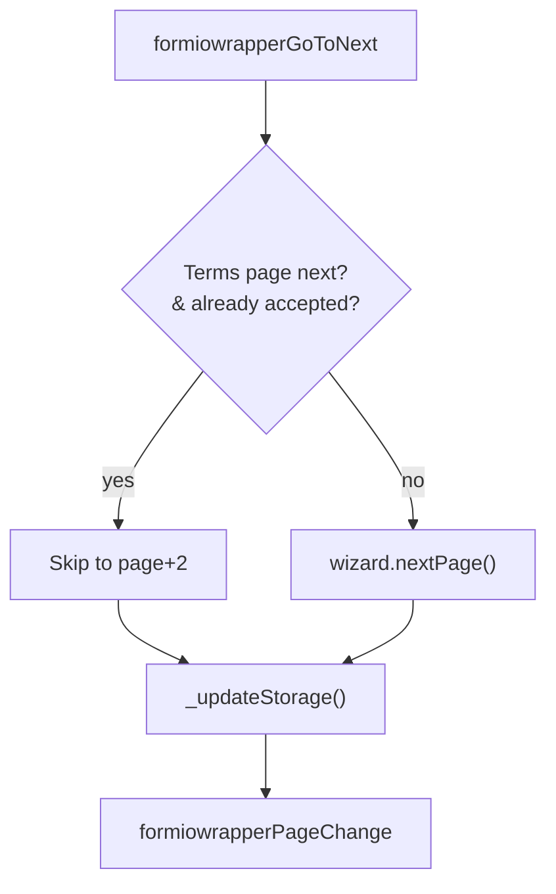
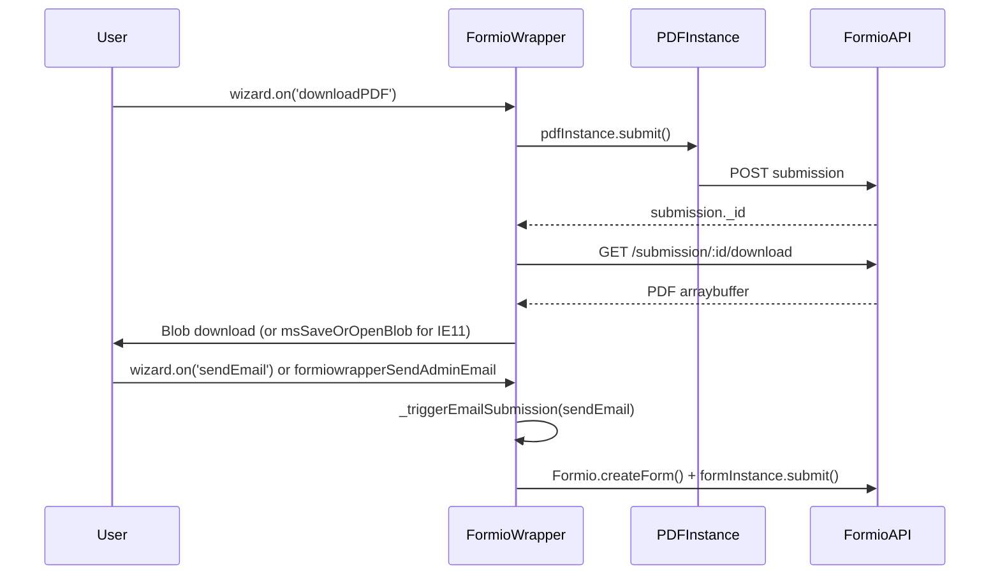

## Overview

`FormioWrapper` (`src/components/formio-wrapper.js`) is the core adapter between the Label Buster SPA and the Form.io Wizard API. It initialises the Form.io wizard, manages navigation, persists form state to `localStorage`, triggers PDF generation and email dispatch, and publishes a custom event bus that drives `ButtonGroup` and `HelpGuide` updates.

## Responsibilities

- Load the Form.io wizard from the configured API endpoint
- Intercept Form.io's native navigation (next/previous/cancel) via custom events
- Persist wizard data and seen-pages to `localStorage` on every render
- Restore wizard state from `localStorage` on page load
- Skip Terms & Conditions pages if already accepted
- Build navigation menu data and button state data on each page change
- Submit form for PDF generation and email delivery
- Track form interactions via `window.dataLayer` (Google Analytics / GTM)

## Event Bus

`FormioWrapper` is driven entirely through `window` events. It listens for inbound commands and emits outbound notifications.

### Inbound Events (consumed by FormioWrapper)

| Event | Description |
|---|---|
| `DOMContentLoaded` | Triggers `initialise()` — loads Form.io wizard |
| `formiowrapperGoToNext` | Navigate to next page; scrolls to top |
| `formiowrapperGoToPrevious` | Navigate to previous page; scrolls to top |
| `formiowrapperCancel` | Clear storage and reload (hard reset) or navigate to page 0 |
| `formiowrapperGoToPage` | Navigate to specific page (`event.detail.page`) |
| `formiowrapperSendAdminEmail` | Submit form with `sendEmail = 'admin'` |

### Outbound Events (emitted by FormioWrapper)

| Event | `detail` payload | Consumers |
|---|---|---|
| `formiowrapperPageChange` | `{ title, page, navigation, buttons }` | `ButtonGroup`, `HelpGuide` |
| `formioWrapperTracking` | `{ form, change, title }` | GTM/dataLayer integration in `index.js` |
| `formioNewPageRender` | `{ title, page }` | `HelpGuide`, `index.js` (admin email trigger at page 10) |

## Initialisation Flow

## Navigation Logic

- Page validity is checked via `wizard.pages[offset].checkValidity(data)` before enabling Next
- `lastNavigation` tracks the last manually navigated page and is stored in `localStorage`
- On page restore, the wrapper finds the lowest valid page from `lastNavigation` downward and navigates there

## LocalStorage Schema

Data is double-serialised: each value is `JSON.stringify`'d individually, then the whole object is `JSON.stringify`'d again. Key is the form title (`"Label Buster"`).

| Field | Type | Description |
|---|---|---|
| `page` | number | Last active page index |
| `_seenPages` | number[] | Pages the user has visited |
| `lastNavigation` | number | Last page the user manually navigated to |
| `lbtermsAndConditions` | boolean | Terms acceptance state (separate key in `localStorage`) |
| `[formio field keys]` | any | All wizard form data fields |

Storage is cleared entirely on Cancel (when `clearStorageOnCancel: true`), which triggers `document.location.reload()`.

## Public API Surface

| Method | Parameters | Returns | Description |
|---|---|---|---|
| `constructor` | `configuration: Object` | — | Wires event listeners; does not load the form |
| `initialise` | `firstInit?: boolean` | void | Loads Form.io wizard from `config.form.location` |
| `scrollToTop` | `baseElement?, focusTarget?` | void | Scrolls window and focuses `#focusTarget` |
| `buildProgressMenuData` | — | `Object[]` | Returns nav item descriptors for the step menu |
| `buildButtonData` | — | `Object[]` | Returns button descriptors: `[previous, next, cancel]` |
| `notLoaded` | — | throws | Throws a structured error if wizard not yet loaded |

## PDF and Email Flow

- `createPDFInstance()` is called after wizard initialisation; only runs if `config.form.pdfEndpoint` and `config.form.sendPDF` are truthy
- Admin email overrides `emailField` and `emailConfirmField` values temporarily before submission, restoring them after
- User email has a 3-second debounce (`requestedEmail` flag + `setTimeout`)

## Design Decisions

- **Event-driven decoupling**: ButtonGroup and HelpGuide never hold a reference to FormioWrapper; they subscribe to `formiowrapperPageChange`. This allows them to be initialised independently and makes the architecture testable.
- **Custom navigation replaces Form.io native buttons**: Form.io's built-in wizard navigation cannot be styled to match SWE; all buttons are set to hidden in `formioConfig` and replaced by `ButtonGroup`.
- **Double-JSON serialisation**: Each field is stringified individually before the container object is stringified. This prevents type coercion issues with Form.io's nested data structures when round-tripping through `localStorage`.
- **IE 11 PDF workaround**: Uses `window.navigator.msSaveOrOpenBlob` for IE 11; `URL.createObjectURL` for modern browsers. Firefox requires `revokeObjectURL` in a 100ms timeout.
