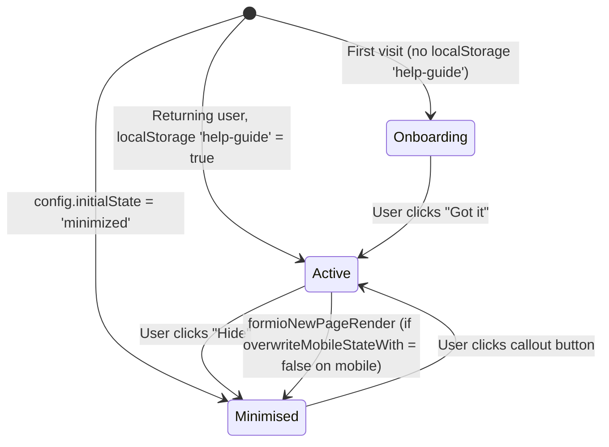
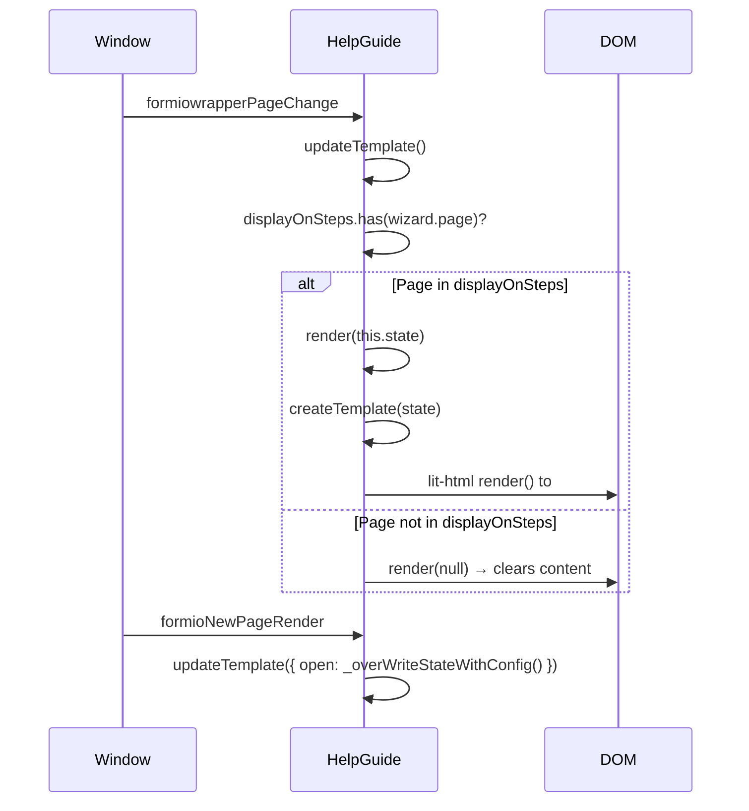

## Overview

`HelpGuide` (`src/components/help-guide.js`) is a lit-html component that renders a sliding contextual help panel alongside the wizard. It displays step-specific content from partial views, supports onboarding, open, minimised, and hidden states, and manages keyboard accessibility including focus trapping for accordion sections.

## Responsibilities

- Render step-specific help content determined by the current wizard page
- Manage panel open/close state with animation classes
- Show an onboarding overlay on first visit; suppress on subsequent visits using `localStorage`
- Respond to responsive breakpoints to override panel state on mobile
- Manage accordion behaviour within the help panel including keyboard focus trapping
- Listen for hash changes to open specific accordion items via deep links

## View Configuration

`HelpGuide` receives a `views` object mapping page numbers (and the key `'initial'`) to template functions:

| Key | Template source | Displayed when |
|---|---|---|
| `initial` | `help-guide-lb-initial.js` | First visit onboarding overlay |
| `3` | `help-guide-lb-main.js` | Wizard page 3 |
| `4` | `help-guide-lb-names.js` | Wizard page 4 |
| `5` | `help-guide-lb-business.js` | Wizard page 5 |
| `6` | `help-guide-lb-date-mark.js` | Wizard page 6 |
| `7` | `help-guide-lb-storage.js` | Wizard page 7 |
| `8` | `help-guide-lb-ingredient.js` | Wizard page 8 |
| `9` | `help-guide-lb-statement.js` | Wizard page 9 |

`displayOnSteps: [3, 4, 5, 6, 7, 8, 9]` — the help guide is hidden (renders `null`) on all other pages including the terms page, home, and summary.

## State Machine

State properties:

| Property | Type | Description |
|---|---|---|
| `firstView` | boolean | True during onboarding; shows overlay and disables close button |
| `open` | boolean | Controls panel visibility and animation CSS classes |

CSS classes applied to `.help-guide-content`:
- `open-menu` / `close-menu`: applied when `shouldAnimate` is true (i.e. on explicit state change)
- `hide`: applied when `!open && !shouldAnimate` to fully hide after animation

## Render Flow

## Mobile/Desktop State Override

`_overWriteStateWithConfig()` determines whether to override `this.state.open` on page change:

| Condition | Result |
|---|---|
| `state.firstView === true` | Keep current open state (no override during onboarding) |
| `window.innerWidth <= 991` and `overwriteMobileStateWith` is defined | Use `overwriteMobileStateWith` value |
| `window.innerWidth > 991` and `overwriteDesktopStateWith` is defined | Use `overwriteDesktopStateWith` value |
| Neither condition met | Keep current `state.open` |

Default config: `overwriteMobileStateWith: false` — help guide auto-closes on mobile on every page change.

## Accessibility

### Keyboard Focus Trap (Accordion)

When a `.accordion-btn` is clicked to open an accordion item, `_addKeyboardTrap()` is called:

1. Finds all focusable elements within the active accordion article
2. Focuses the first element
3. Adds a `keydown` listener that traps Tab within the accordion
4. When focus reaches the last element: closes the panel, returns focus to the triggering button, removes the listener

### Onboarding Focus Lock

During `firstView`, a `keydown` listener on `document` intercepts all keys and repeatedly focuses `#gotHelpGuide` until the user clicks it. This prevents keyboard users from tabbing away from the modal-like onboarding overlay.

### Hash-Based Deep Links

`window.addEventListener('hashchange')` strips `#` from `location.hash` and calls `_openAccordionItem(id)` — allows external links to open a specific accordion section within the help guide.

## Constructor Parameters

| Parameter | Type | Description |
|---|---|---|
| `target` | HTMLElement | DOM element to render into (e.g. `#help-guide`) |
| `config.views` | Object | Map of page number → template function |
| `config.config` | Object | Help guide display configuration (see below) |
| `config.formWrapper` | FormioWrapper | Instance used to read `wizard.page` |
| `config.displayOnSteps` | number[] | Pages on which the guide renders |

`config.config` properties:

| Key | Type | Description |
|---|---|---|
| `initialState` | string | `'onboarding'`, `'active'`, or `'minimized'` |
| `overwriteMobileStateWith` | boolean\|false | Auto-state on mobile page change; `false` = auto-close |
| `overwriteDesktopStateWith` | boolean\|undefined | Auto-state on desktop page change; undefined = no override |
| `mobileSize` | number | Breakpoint in px (default 991) |

## Design Decisions

- **lit-html for templating**: Same rationale as ButtonGroup — minimal overhead, IE 11 compatible.
- **`localStorage` for first-visit detection**: Key `'help-guide'` is set to `true` after the onboarding screen; `initialState` from config is used only on first visit. Subsequent visits skip onboarding regardless of config.
- **Accordion via CSS checkboxes**: The accordion uses `input[type="checkbox"]` checked state for open/close rather than JS class toggling, following the SWE QG accordion pattern. JavaScript manipulates `.checked` directly for programmatic control.
- **Null render to hide**: Passing `null` to lit-html's `render()` clears the DOM target entirely rather than hiding with CSS — avoids accessibility issues with hidden but focusable content.
