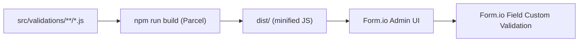

## Overview

Validations in Label Buster are JavaScript snippets stored in `src/validations/` that are built by Parcel and then manually copy-pasted into the Form.io wizard's field custom validation blocks. They are not dynamically loaded at runtime; they execute within Form.io's validation context.

## Deployment Model

Form.io executes the pasted validation JavaScript with its own context; the SPA does not call these functions directly. Tests in `test/` cover the wrapper components but not the validation snippets.

## Validation Modules by Section

### Business Details (`src/validations/business-details/`)

| File | Validates | Rule |
|---|---|---|
| `business-name.js` | Business name field | Required; max length enforcement |
| `address-line-1.js` | Address line 1 | Required |
| `address-line-2.js` | Address line 2 | Optional; format check |
| `suburb.js` | Suburb | Required |
| `state.js` | State | Required; valid Australian state code |
| `postcode.js` | Postcode | Required; 4-digit Australian postcode format |

### Date Marks (`src/validations/date-marks/`)

| File | Validates | Rule |
|---|---|---|
| `best-date.js` | Best before / use-by date | Valid date format and range |
| `lot-identification.js` | Lot ID field | Required when lot ID is provided |
| `no-date-lot-identification.js` | Combined no-date + lot | Conditional: lot required when no date mark selected |

### Food Name and Description (`src/validations/food-name-and-description/`)

| File | Validates | Rule |
|---|---|---|
| `food-name.js` | Product food name | Required; max length |
| `food-description.js` | Food description | Optional; max length |

### Generic (`src/validations/generic/`)

| File | Validates | Rule |
|---|---|---|
| `hiddenObjects.js` | Hidden fields used for internal state | Ensures hidden data fields pass validation silently |
| `others.js` | Catch-all for miscellaneous field patterns | General-purpose presence/format checks |

### Ingredients (`src/validations/ingredients/`)

| File | Validates | Rule |
|---|---|---|
| `ingredients.js` | Ingredient list field | Required when ingredients panel is shown; format check |

### Statements (`src/validations/statements/`)

| File | Validates | Rule |
|---|---|---|
| `alcohol.js` | Alcohol statement field | Required when food contains alcohol |
| `edible-oil.js` | Edible oil origin statement | Required when applicable food type selected |
| `salt.js` | Salt/sodium statement | Required when applicable |

### Storage and Use (`src/validations/storage-and-use/`)

| File | Validates | Rule |
|---|---|---|
| `consume-within.js` | Consume within N days | Positive integer |
| `cook-at.js` | Cooking temperature | Positive number |
| `cook-for.js` | Cooking duration | Positive integer (minutes) |
| `cooking-preparation.js` | Cooking/prep notes | Required when cooking method selected |
| `directions-other-details.js` | Other directions details | Required when "other" option selected |
| `keep-refrigerated-at-maximum.js` | Max refrigeration temp | Must be ≥ minimum temp if both set |
| `keep-refrigerated-at-minimum.js` | Min refrigeration temp | Numeric; must be < maximum |
| `keep-refrigerated-at-or-below.js` | Max storage temp (or-below) | Numeric |
| `microwave-on.js` | Microwave power level | Positive integer (watts) |
| `microwoave-for.js` | Microwave duration | Positive integer (minutes); note: typo in filename (`microwoave`) |
| `stand-for-minutes.js` | Standing time after microwave | Positive integer |
| `storage-other-details.js` | Other storage details text | Required when "other" storage selected |
| `thawed-use-within.js` | Use within N days of thawing | Positive integer |

### Your Label (`src/validations/your-label/`)

| File | Validates | Rule |
|---|---|---|
| `email.js` | User email address | RFC-compliant email format |
| `confirmEmail.js` | Email confirmation field | Must match `email` field |

## Maintenance Workflow

1. Edit the validation file in `src/validations/`
2. Run `npm run build` to produce minified output in `dist/`
3. Copy the relevant minified validation code from `dist/`
4. Paste into the target field's custom validation block in the Form.io Admin UI
5. Test in the Form.io environment (dev/uat)

Form.io does not always preserve custom JavaScript reliably; always re-verify pasted content after saving. Changes to Form.io form structure may require re-pasting multiple validation scripts.

## Known Issues

- `microwoave-for.js` filename contains a typo (`microwoave` instead of `microwave`); the file content is correct, only the filename is misspelled.
- Validations cannot be unit tested in isolation within this project's test suite because they execute inside Form.io's runtime context, not as standard JavaScript modules.
